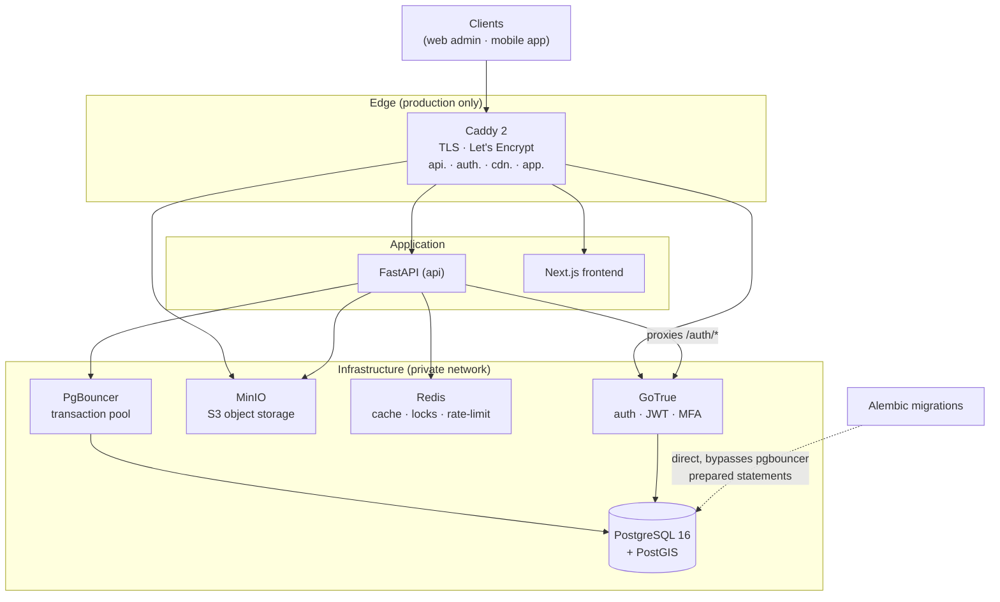

# MasjidKoi Backend

FastAPI REST API for **MasjidKoi** — a masjid discovery, prayer-times, community, and
donation platform for Bangladesh. It powers the Next.js web admin panel and the
(upcoming) React Native mobile app.

The service exposes ~145 endpoints across masjid discovery (PostGIS geo-search),
prayer times, announcements & events, community feed, Q&A, community photos,
gamification, donations (SSLCommerz), co-admin management, moderation, and platform
administration.

---

## Stack

| Concern | Technology |
|---|---|
| Language / runtime | **Python 3.12** |
| Web framework | **FastAPI** (async) |
| ORM / driver | **SQLAlchemy 2 (async) + asyncpg** |
| Database | **PostgreSQL 16 + PostGIS 3.4** |
| Connection pooling | **PgBouncer** (transaction pool mode) |
| Migrations | **Alembic** (psycopg2 sync driver) |
| Auth | **GoTrue** v2.151 (Supabase fork) — JWT, TOTP/MFA, email invites |
| Object storage | **MinIO** (S3-compatible) — photos, avatars, imports |
| Cache / locks / rate-limit | **Redis 7** |
| Background jobs | **APScheduler** (in-process cron) |
| Reverse proxy / TLS | **Caddy 2** (automatic Let's Encrypt) — prod only |
| Payments | **SSLCommerz** |
| Package manager | **uv** |

### Architecture



> In production, all inbound traffic passes through Caddy; only Caddy is public.
> In local dev there is no Caddy — the API, GoTrue, MinIO, and frontend ports are
> published directly (see the URL table below). FastAPI proxies **all** `/auth/*`
> traffic to GoTrue; clients never call GoTrue directly. It verifies GoTrue-issued
HS256 JWTs locally with the shared `GOTRUE_JWT_SECRET`.

---

## Layered structure

Every feature follows a strict **Repository → Service → Route** flow. Routes never
touch the database directly; all DB I/O lives in a repository. See
[`CLAUDE.md`](./CLAUDE.md) for the full rulebook (session handling, PostGIS
conventions, error handling, PgBouncer constraints).

```
app/
  models/         SQLAlchemy ORM models (define first, always)
  repositories/   raw DB queries only — no business logic
  services/       business logic; orchestrates repositories; raises HTTPException
  routers/        HTTP layer — parse request, call service, return response
  schemas/        Pydantic request/response models
  dependencies/   FastAPI Depends() factories
  core/           config, security (JWT decode), logging, middleware, scheduler
  db/             async session factory + declarative base
migrations/       Alembic migrations (28 revisions)
scripts/          admin utilities, seeders, e2e smoke tests
tests/            pytest suite
docs/             design notes / API gap tracking
```

---

## Quick Start (local development)

### Prerequisites

- **Docker** & **Docker Compose**
- **[uv](https://docs.astral.sh/uv/)** — `curl -LsSf https://astral.sh/uv/install.sh | sh`

### 1. Environment

```bash
cp .env.example .env
```

Then generate the two required secrets and paste them into `.env`:

```bash
# JWT secret shared between GoTrue and FastAPI
openssl rand -base64 32          # → GOTRUE_JWT_SECRET

# Service-role token FastAPI uses to call GoTrue admin endpoints.
# Run AFTER setting GOTRUE_JWT_SECRET above.
uv run python scripts/gen_service_token.py   # → GOTRUE_SERVICE_ROLE_KEY
```

For dev, `GOTRUE_MAILER_AUTOCONFIRM=true` means no SMTP is needed — invite/reset
emails are auto-confirmed.

### 2. Start the stack

```bash
docker compose up
```

This brings up postgres, pgbouncer, gotrue, minio (+ bucket init), redis, the API,
and the frontend.

| Service | URL |
|---|---|
| API | http://localhost:8000 |
| API docs (Swagger) | http://localhost:8000/docs |
| API docs (ReDoc) | http://localhost:8000/redoc |
| Health check | http://localhost:8000/health |
| GoTrue | http://localhost:9999 |
| MinIO S3 | http://localhost:9090 |
| MinIO console | http://localhost:9091 |
| Frontend | http://localhost:3000 |

> Postgres, PgBouncer, and MinIO are bound to `127.0.0.1` only — not exposed to
> the network.

### 3. Apply migrations

Postgres isn't reachable from your host by default, so run Alembic **inside** the
API container. Migrations connect **directly** to Postgres (not via PgBouncer) —
transaction-pool mode can't route prepared statements.

```bash
docker compose exec api uv run alembic upgrade head
```

### 4. Seed a platform admin

```bash
# Interactive — prompts for email; set ADMIN_PASSWORD to skip the invite email.
docker compose exec api uv run python scripts/seed_platform_admin.py
```

### 5. Verify

```bash
curl http://localhost:8000/health
# {"status":"ok","postgis_version":"3.4 …", ...}
```

---

## Database & migrations

Model first, then migration — **always**. Never query a table without a migration,
never hand-write DDL, never `alembic stamp` to skip.

```bash
# 1. Define the SQLAlchemy model in app/models/
# 2. Import it in app/db/base.py so autogenerate can see it
# 3. Auto-generate
docker compose exec api uv run alembic revision --autogenerate -m "describe_change"

# 4. REVIEW the generated file in migrations/versions/ — autogenerate is known to
#    propose spurious destructive ops (e.g. dropping the PostGIS GIST index).
#    Prune it down to your intended change only.

# 5. Apply
docker compose exec api uv run alembic upgrade head
```

Common Alembic commands (also wrapped by `scripts/db.sh`):

```bash
docker compose exec api uv run alembic current       # current revision
docker compose exec api uv run alembic history       # full history
docker compose exec api uv run alembic downgrade -1  # roll back one revision
```

**PostgreSQL notes**

- FastAPI connects through PgBouncer; the async engine uses `NullPool`,
  `autoflush=False`, `expire_on_commit=False`, and disables prepared-statement
  caching (required for PgBouncer transaction mode).
- Alembic connects to Postgres directly. `migrations/env.py` reads
  `settings.DATABASE_URL` and swaps `asyncpg` → `psycopg2` for the sync run.
- Spatial index on `masjids.location` (GIST) is created in the initial migration.
  Always filter `status = 'Active'` before a spatial predicate so the index is used.

---

## Development

```bash
uv sync                    # install dependencies (incl. dev group)
uv run ruff check .        # lint
uv run ruff format .       # format
uv run pytest              # run the test suite (26 test modules)
```

Ruff selects `E, W, F, I, B`. FastAPI's `Depends()` in defaults (B008) and
`raise ... from` (B904) are house style — leave them as-is.

### Useful scripts

| Script | Purpose |
|---|---|
| `scripts/gen_service_token.py` | Generate the GoTrue `service_role` JWT |
| `scripts/seed_platform_admin.py` | Create/update a platform admin in GoTrue |
| `scripts/seed_synthetic_bd.py` | Seed synthetic Bangladesh masjid data |
| `scripts/seed_nearby_test.sql` | SQL seed for geo-search testing |
| `scripts/live_api_harness.py` | Smoke-test all ~145 endpoints end-to-end |
| `scripts/e2e_*.py` | Targeted e2e flows (photos, moderation, Q&A) |
| `scripts/db.sh` | Alembic + psql convenience wrapper |

---

## Configuration

All config is environment-driven via `app/core/config.py` (pydantic-settings).
See `.env.example` (dev) and `.env.production.example` (prod) for the full list.
Key variables:

| Variable | Description |
|---|---|
| `DATABASE_URL` | asyncpg URL via **PgBouncer** (app runtime) |
| `GOTRUE_JWT_SECRET` | Shared HS256 secret — **must match** GoTrue |
| `GOTRUE_SERVICE_ROLE_KEY` | Service JWT for GoTrue admin calls |
| `GOTRUE_URL` | Internal GoTrue base URL (`http://gotrue:9999`) |
| `REDIS_URL` | Redis connection (cache, rate-limit, scheduler locks) |
| `AWS_ACCESS_KEY_ID` / `AWS_SECRET_ACCESS_KEY` | MinIO/S3 credentials |
| `S3_PUBLIC_URL` | Public base URL used to build object links for clients |
| `SCHEDULER_ENABLED` | Run APScheduler on this instance (single instance only) |
| `PUSH_ENABLED` / `EXPO_ACCESS_TOKEN` | Expo push delivery |
| `SSLCOMMERZ_*` | Payment gateway credentials |
| `SMTP_*` | Outbound email (prod) |
| `CORS_ORIGINS` | Comma-separated allowed origins |

### Background jobs (APScheduler)

When `SCHEDULER_ENABLED=true`, one API instance runs these cron jobs (each also
self-guards with a Redis lock):

- **publish_scheduled_announcements** — every minute
- **send_daily_digests** — hourly, per user's chosen Asia/Dhaka digest hour
- **send_recurring_donation_nudges** — every 15 min
- **sweep_stale_pending_donations** — hourly (expire abandoned PENDING donations)
- **reap_push_receipts** — every 10 min (prune dead Expo tokens)
- **purge_deleted_accounts** — daily 03:30 UTC (anonymise soft-deleted accounts)

Run the API with a **single worker** so these jobs fire exactly once.

---

## Deployment (production)

Production runs a hardened stack behind Caddy. It differs from dev:

- Runs the hardened runtime image — **non-root**, no `--reload`, no source mount.
- **Nothing internal is published** — only Caddy (80/443) is public. Postgres,
  PgBouncer, GoTrue, MinIO, and Redis stay on the private Docker network.
- Caddy terminates TLS and auto-provisions Let's Encrypt certs (see `Caddyfile`).
- A one-shot `migrate` service runs Alembic (built from the `migrate` Docker
  stage, which includes the sync driver) **before** the API starts.
- MinIO photo/avatar buckets get an anonymous-download policy so client URLs
  resolve; the imports bucket stays private.
- All credentials come from `.env.production` — no hardcoded defaults.

### 1. Configure

```bash
cp .env.production.example .env.production
# Fill in: strong POSTGRES_PASSWORD, GOTRUE_JWT_SECRET, GOTRUE_SERVICE_ROLE_KEY,
# MINIO_ROOT_USER/PASSWORD, REDIS_PASSWORD, SMTP_*, SSLCOMMERZ_*, and the
# API_DOMAIN / AUTH_DOMAIN / CDN_DOMAIN / APP_DOMAIN + ACME_EMAIL for Caddy.
```

> `POSTGRES_USER` **must stay** `masjidkoi` — `scripts/init-db.sql` grants the auth
> schema to that role literally. Harden the password, not the username.

Point DNS `A`/`AAAA` records for all four domains at the host before starting Caddy
(Let's Encrypt validates over HTTP/TLS).

### 2. Launch

```bash
docker compose -f docker-compose.prod.yml --env-file .env.production up -d --build
```

Startup order is enforced by health checks: postgres → pgbouncer/gotrue,
`migrate` runs to completion, then the API (gated on `service_healthy`), then Caddy
and the frontend.

### 3. Post-deploy

```bash
# Seed the first platform admin
docker compose -f docker-compose.prod.yml exec api \
  uv run python scripts/seed_platform_admin.py

# Tail logs / check health
docker compose -f docker-compose.prod.yml logs -f api
curl https://<API_DOMAIN>/health
```

### Re-running migrations later

```bash
docker compose -f docker-compose.prod.yml run --rm migrate
```

> **Deploy TODO:** set `FORWARDED_ALLOW_IPS` to the Caddy container's Docker-network
> CIDR (never `*`) so `--proxy-headers` trusts only Caddy's `X-Forwarded-For`.
> Left unset it falls back to `127.0.0.1` — safe, but `request.client.host`
> resolves to Caddy's IP until the CIDR is set. See the note in `Dockerfile`.

---

## Health & observability

`GET /health` executes `SELECT PostGIS_Version()` against the DB and returns:

- `200 {"status":"ok", ...}` when the database is reachable
- `503 {"status":"degraded", ...}` otherwise

Container health checks poll this endpoint so dependents gate on `service_healthy`,
not just start order. Request logging is handled by `LoggingMiddleware`; unhandled
500s are caught by a global handler that re-stamps CORS headers (so the browser can
read the error) and never leaks internals.

---

## API documentation

- **Swagger UI** — `/docs`
- **ReDoc** — `/redoc`
- **OpenAPI JSON** — `/openapi.json`

---

## License

Proprietary — MasjidKoi / Team T40 Insanity Check.
